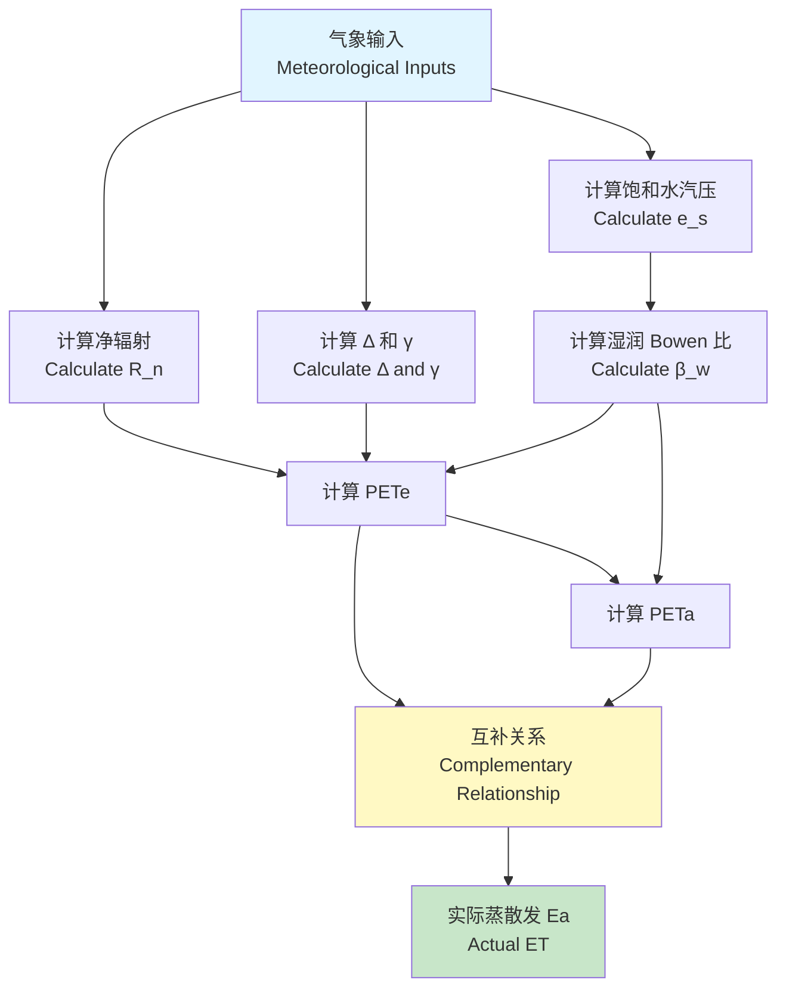

# Theoretical Background of PET-CR Library
# PET-CR 库的理论背景

**Last Updated**: 2025-12-04
**Version**: 1.0
**Authors**: PET-CR Development Team

---

## Table of Contents

1. [Introduction](#introduction)
2. [Land-Atmosphere Framework (Zhou & Yu 2025)](#land-atmosphere-framework)
3. [Traditional Complementary Relationship Models](#traditional-cr-models)
4. [BGCR-Budyko Model](#bgcr-budyko-model)
5. [Attribution Analysis Framework](#attribution-analysis)
6. [Physical Constants and Units](#physical-constants)
7. [Mathematical Derivations](#mathematical-derivations)
8. [References](#references)

---

## 1. Introduction | 简介

### 1.1 The Challenge of Estimating Evapotranspiration | 估算蒸散发的挑战

**中文**：

蒸散发（ET）是水循环的关键环节，占陆地降水的60-70%。然而，直接测量实际蒸散发（Actual ET, Ea）非常困难，原因包括：
- 需要昂贵的涡度相关系统（Eddy Covariance）
- 观测站点稀疏，难以区域化
- 在无灌溉的自然流域，土壤湿度数据缺乏

**English**:

Evapotranspiration (ET) is a critical component of the water cycle, accounting for 60-70% of terrestrial precipitation. However, directly measuring actual evapotranspiration (Ea) is challenging due to:
- Requirement for expensive eddy covariance systems
- Sparse observation networks, difficult to regionalize
- Lack of soil moisture data in natural, rainfed catchments

### 1.2 The Complementary Relationship Paradigm | 互补关系范式

**核心思想 | Core Idea**:

Bouchet (1963) 提出了一个革命性的假设：在相同的大气边界层条件下，**潜在蒸散发（Potential ET）与实际蒸散发（Actual ET）存在互补关系**。这意味着我们可以仅用常规气象数据估算 Ea，而无需土壤湿度信息。

Bouchet (1963) proposed a revolutionary hypothesis: under the same atmospheric boundary layer conditions, **Potential ET and Actual ET have a complementary relationship**. This means we can estimate Ea using only routine meteorological data, without soil moisture information.

---

## 2. Land-Atmosphere Framework (Zhou & Yu 2025) | 陆-气耦合框架

### 2.1 Conceptual Foundation | 概念基础

Zhou & Yu (2025) 在 *Nature Climate Change* 上提出了一个统一的陆-气耦合框架，将传统的 CR 理论扩展到能量-水分耦合系统。

Zhou & Yu (2025) proposed a unified land-atmosphere coupling framework in *Nature Climate Change*, extending traditional CR theory to coupled energy-water systems.

#### 2.1.1 Key Concepts: PETe and PETa | 核心概念

**PETe (Energy-limited Potential ET) | 能量受限潜在蒸散发**:

在**湿润表面**（如湖泊、饱和土壤），假设水分无限供应，蒸散发完全受能量控制：

For **wet surfaces** (lakes, saturated soil), assuming unlimited water supply, ET is entirely controlled by available energy:

$$
PET_e = \\frac{\\Delta R_n + \\rho c_p \\frac{e_s - e_a}{r_a}}{\\Delta + \\gamma}
$$

其中 | where:
- $\\Delta$: 饱和水汽压曲线斜率 | Slope of saturation vapor pressure curve [kPa/K]
- $R_n$: 净辐射 | Net radiation [W/m²]
- $\\rho$: 空气密度 | Air density [kg/m³]
- $c_p$: 空气比热容 | Specific heat of air [J/(kg·K)]
- $e_s$: 饱和水汽压 | Saturation vapor pressure [kPa]
- $e_a$: 实际水汽压 | Actual vapor pressure [kPa]
- $r_a$: 空气动力学阻抗 | Aerodynamic resistance [s/m]
- $\\gamma$: 干湿表常数 | Psychrometric constant [kPa/K]

**物理意义 | Physical Meaning**: PETe 代表在当前能量条件下的**最大可能蒸发**，相当于 Priestley-Taylor ET 的改进版。

PETe represents the **maximum possible evaporation** under current energy conditions, an improved version of Priestley-Taylor ET.

---

**PETa (Aerodynamics-limited Potential ET) | 动力受限潜在蒸散发**:

在**干燥表面**（如裸地、枯草），假设水分无限供应（反事实假设），此时蒸散发完全受大气需求（VPD 和风速）控制：

For **dry surfaces** (bare soil, dead grass), assuming unlimited water supply (counterfactual scenario), ET is entirely controlled by atmospheric demand (VPD and wind):

$$
PET_a = \\frac{\\Delta R_n + \\rho c_p \\frac{e_s - e_a}{r_a} \\cdot \\frac{\\Delta + \\gamma}{\\gamma}}{\\Delta + \\gamma}
$$

**物理意义 | Physical Meaning**: PETa 代表大气的**吸水能力**（"口渴程度"），类似于传统的 Penman ET。

PETa represents the atmosphere's **water-absorbing capacity** ("thirstiness"), similar to traditional Penman ET.

---

#### 2.1.2 The Complementary Relationship in Energy Space | 能量空间的互补关系

Zhou & Yu (2025) 将互补关系表达在**能量通量**空间：

Zhou & Yu (2025) express the complementary relationship in **energy flux** space:

$$
\\lambda E_a = 2 \\lambda PET_e - \\lambda PET_a
$$

其中 | where:
- $\\lambda$: 潜热系数 | Latent heat of vaporization [J/kg]
- $E_a$: 实际蒸散发 | Actual evapotranspiration [kg/(m²·s)]

**转换为常用单位 | Convert to common units** (W/m²):

$$
LH = 2 \\cdot PET_e - PET_a
$$

---

### 2.2 Wet Bowen Ratio | 湿润 Bowen 比

#### 2.2.1 Definition | 定义

Bowen 比定义为感热通量与潜热通量之比：

The Bowen ratio is defined as the ratio of sensible to latent heat flux:

$$
\\beta = \\frac{SH}{LH}
$$

**湿润 Bowen 比 | Wet Bowen Ratio** ($\\beta_w$) 是在**假设表面湿润**条件下计算的 Bowen 比：

The **wet Bowen ratio** ($\\beta_w$) is calculated under the **assumption of a wet surface**:

$$
\\beta_w = \\frac{\\gamma (T_s - T_a)}{\\Delta (e_s(T_s) - e_a)}
$$

其中 | where:
- $T_s$: 地表温度 | Surface temperature [K]
- $T_a$: 气温 | Air temperature [K]
- $e_s(T_s)$: 地表温度下的饱和水汽压 | Saturation vapor pressure at surface temperature [kPa]

---

#### 2.2.2 Physical Constraints | 物理约束

Zhou & Yu (2025) 发现，$\\beta_w$ 必须满足物理约束：

Zhou & Yu (2025) found that $\\beta_w$ must satisfy physical constraints:

$$
\\beta_w^{\\min} \\leq \\beta_w \\leq \\beta_w^{\\max}
$$

**推导 | Derivation**:

1. **上限 | Upper limit**: 当地表刚好达到湿球温度（wet-bulb temperature）时
   - When surface just reaches wet-bulb temperature:
   $$
   \\beta_w^{\\max} = \\frac{\\gamma}{\\Delta + \\gamma}
   $$

2. **下限 | Lower limit**: 当地表温度等于气温时（无感热通量）
   - When surface temperature equals air temperature (no sensible heat):
   $$
   \\beta_w^{\\min} = 0
   $$

**实际应用中的约束 | Practical constraints**:

在 `petcr/land_atmosphere.py` 中，使用更严格的约束：

In `petcr/land_atmosphere.py`, stricter constraints are used:

```python
BETA_W_MIN = 0.0
BETA_W_MAX = 0.6  # 基于全球站点数据 | Based on global site data
```

---

### 2.3 Data Flow Diagram | 数据流图



---

## 3. Traditional Complementary Relationship Models | 传统互补关系模型

### 3.1 Bouchet (1963) Model | Bouchet 模型

#### 3.1.1 Original Hypothesis | 原始假设

Bouchet 提出，在相同的大气边界层下：

Bouchet proposed that under the same atmospheric boundary layer:

$$
E_a + E_p = 2 E_w
$$

其中 | where:
- $E_a$: 实际蒸发 | Actual evaporation
- $E_p$: Penman 潜在蒸发 | Penman potential evaporation
- $E_w$: 湿环境蒸发（Priestley-Taylor）| Wet-environment evaporation

#### 3.1.2 Physical Interpretation | 物理解释

**能量守恒视角 | Energy Conservation Perspective**:

$$
R_n = LH + SH + G
$$

- 当水分充足时 | When water is sufficient:
  - $LH \\uparrow$ (蒸发增加 | Evaporation increases)
  - $SH \\downarrow$ (感热减少 | Sensible heat decreases)
  - 空气温度 $\\downarrow$、湿度 $\\uparrow$ | Air temperature ↓, humidity ↑
  - 因此 $E_p \\downarrow$ (大气需求减少 | Atmospheric demand decreases)

- 当水分缺乏时 | When water is scarce:
  - $LH \\downarrow$ (蒸发减少 | Evaporation decreases)
  - $SH \\uparrow$ (感热增加 | Sensible heat increases)
  - 空气温度 $\\uparrow$、湿度 $\\downarrow$ | Air temperature ↑, humidity ↓
  - 因此 $E_p \\uparrow$ (大气需求增加 | Atmospheric demand increases)

**这就是"互补"的本质 | This is the essence of "complementarity"**: 一个增加，另一个减少，总和保持相对稳定。

One increases, the other decreases, and the sum remains relatively stable.

---

### 3.2 Sigmoid CR Model (Han & Tian 2018) | Sigmoid 模型

#### 3.2.1 Mathematical Form | 数学形式

Han & Tian (2018) 提出了一个更灵活的 sigmoid 函数形式：

Han & Tian (2018) proposed a more flexible sigmoid functional form:

$$
E_a = \\frac{2 \\beta E_w}{1 + \\exp\\left[\\frac{E_p - E_w}{\\beta E_w}\\right]}
$$

其中 | where:
- $\\beta$: 经验参数，通常在 1.2-1.4 之间 | Empirical parameter, typically 1.2-1.4

#### 3.2.2 Advantages | 优势

1. **非线性响应 | Nonlinear response**: 更好地捕捉极端条件（极湿润或极干旱）
   - Better captures extreme conditions (very wet or very dry)

2. **可校准性 | Calibratable**: 参数 $\\beta$ 可以根据实测数据校准
   - Parameter $\\beta$ can be calibrated with observed data

3. **渐近行为 | Asymptotic behavior**:
   - 当 $E_p \\ll E_w$ (湿润) | When wet: $E_a \\to 2\\beta E_w$
   - 当 $E_p \\gg E_w$ (干旱) | When dry: $E_a \\to 0$

---

### 3.3 Polynomial CR Model (Brutsaert 2015) | 多项式模型

#### 3.3.1 Mathematical Form | 数学形式

Brutsaert (2015) 基于能量守恒推导出二次多项式形式：

Brutsaert (2015) derived a quadratic polynomial form based on energy conservation:

$$
E_a = \\frac{-b + \\sqrt{b^2 - 4ac}}{2a}
$$

其中 | where:
$$
\\begin{align}
a &= 1 \\\\
b &= -(2E_w + E_p) \\\\
c &= 2E_w E_p
\\end{align}
$$

#### 3.3.2 Derivation Sketch | 推导草图

从能量分配和互补假设出发 | Starting from energy partitioning and complementary assumption:

$$
\\begin{align}
E_a + E_p &= 2E_w \\quad \\text{(Bouchet hypothesis)} \\\\
E_a E_p &= \\text{const} \\quad \\text{(Empirical constraint)}
\\end{align}
$$

通过代数操作得到二次方程 | Obtain quadratic equation through algebraic manipulation.

---

### 3.4 Model Comparison Table | 模型对比表

| 模型 Model | 公式 Formula | 参数数量 Parameters | 优点 Advantages | 缺点 Disadvantages |
|-----------|-------------|---------------------|----------------|-------------------|
| **Bouchet** | $E_a = 2E_w - E_p$ | 0 | 最简单；理论完美<br>Simplest; theoretically perfect | 过于理想化<br>Too idealized |
| **Sigmoid** | $E_a = \frac{2\beta E_w}{1 + e^{(E_p-E_w)/(\beta E_w)}}$ | 1 ($\beta$) | 灵活；可校准<br>Flexible; calibratable | 需要实测数据<br>Needs observations |
| **Polynomial** | 二次方程<br>Quadratic | 0 | 物理基础强<br>Strong physics | 数学复杂<br>Math complex |
| **AA (Advection-Aridity)** | $E_a = E_w \frac{2E_p - E_w}{E_p}$ | 0 | 适用于平原<br>Good for plains | 对地形敏感<br>Terrain-sensitive |

---

## 4. BGCR-Budyko Model | BGCR-Budyko 模型

### 4.1 Budyko Framework | Budyko 框架

#### 4.1.1 Budyko Hypothesis | Budyko 假设

在**长期平均**（多年尺度）下，流域的水量平衡可表示为：

For **long-term averages** (multi-year scale), catchment water balance can be expressed as:

$$
\\frac{E}{P} = f\\left(\\frac{PET}{P}, n\\right)
$$

其中 | where:
- $E$: 蒸散发 | Evapotranspiration [mm/year]
- $P$: 降水 | Precipitation [mm/year]
- $PET$: 潜在蒸散发 | Potential evapotranspiration [mm/year]
- $n$: 流域参数（反映下垫面特征）| Catchment parameter (surface characteristics)

#### 4.1.2 Fu (1981) Parameterization | Fu 参数化

Fu (1981) 提出了一个解析形式：

Fu (1981) proposed an analytical form:

$$
\\varepsilon = 1 + \\phi - \\left(1 + \\phi^n\\right)^{1/n}
$$

其中 | where:
- $\\varepsilon = E/P$: 蒸发比 | Evaporative index
- $\\phi = PET/P$: 干燥度指数 | Aridity index
- $n$: Budyko 参数 | Budyko parameter

**物理约束 | Physical constraints**:
- 能量限制 | Energy limit: $E \\leq PET$ → $\\varepsilon \\leq \\phi$
- 水分限制 | Water limit: $E \\leq P$ → $\\varepsilon \\leq 1$

---

### 4.2 BGCR Integration | BGCR 整合

#### 4.2.1 Motivation | 动机

传统 Budyko 模型仅适用于**年尺度**，无法处理**月尺度或日尺度**的 ET 估算。BGCR (Budyko-based Generalized Complementary Relationship) 将 Budyko 框架与 CR 理论结合。

Traditional Budyko models only apply to **annual scales**, unable to handle **monthly or daily** ET estimation. BGCR (Budyko-based Generalized Complementary Relationship) combines Budyko framework with CR theory.

#### 4.2.2 BGCR Monthly Model | BGCR 月尺度模型

**步骤 | Steps**:

1. **计算 Penman 分量 | Calculate Penman components**:
   $$
   \\begin{align}
   E_{rad} &= \\frac{\\Delta}{\\Delta + \\gamma} \\cdot \\frac{R_n}{\\lambda} \\\\
   E_{aero} &= \\frac{\\gamma}{\\Delta + \\gamma} \\cdot \\frac{f(u) \\cdot VPD}{\\lambda}
   \\end{align}
   $$

2. **计算 Budyko 参数 $w$ | Calculate Budyko parameter $w$**:
   - **BGCR-1**: 基于土壤湿度指数 SI | Based on soil index SI:
     $$
     w = w_0 \\cdot SI
     $$
   - **BGCR-2**: 引入反照率修正 | Include albedo correction:
     $$
     w = w_0 \\cdot SI \\cdot (1 - \\alpha)
     $$

3. **月尺度 ET | Monthly ET**:
   $$
   ET = w \\cdot E_{rad} + (1-w) \\cdot E_{aero}
   $$

**物理意义 | Physical meaning**: $w$ 反映了水分供应对 ET 的约束程度。

$w$ reflects the degree to which water supply constrains ET.

---

### 4.3 Spatial Heterogeneity | 空间异质性

#### 4.3.1 Challenge | 挑战

在大尺度应用中，下垫面（植被、土壤、地形）存在显著空间异质性。传统单点模型无法捕捉这种变异。

In large-scale applications, underlying surface (vegetation, soil, topography) exhibits significant spatial heterogeneity. Traditional single-point models cannot capture this variability.

#### 4.3.2 Solution: Distributed Budyko Parameter | 解决方案：分布式 Budyko 参数

BGCR 模型通过**空间变化的 $n$ 参数**处理异质性：

BGCR model handles heterogeneity through **spatially varying $n$ parameter**:

$$
n(x, y) = f(\\text{vegetation}, \\text{soil}, \\text{topography}, \\text{climate})
$$

**常用关系 | Common relationships**:
- $n \\propto$ 植被覆盖度 | Vegetation cover
- $n \\propto$ 土壤持水能力 | Soil water holding capacity
- $n \\propto$ 地形复杂度 | Topographic complexity

---

## 5. Attribution Analysis Framework | 归因分析框架

### 5.1 Motivation | 动机

**科学问题 | Scientific Question**:

流域径流减少了 30%，是气候变化导致的，还是人类活动（如植树造林、灌溉）导致的？

A catchment's runoff decreased by 30% - is it caused by climate change or human activities (afforestation, irrigation)?

**归因分析的目标 | Goal of attribution analysis**: 定量分离气候变化和下垫面变化对 ET 的贡献。

Quantitatively separate the contributions of climate change and land surface change to ET.

---

### 5.2 Mathematical Decomposition | 数学分解

#### 5.2.1 Total Differential Method | 全微分法

将 ET 视为多个驱动因子的函数 | Treat ET as a function of multiple driving factors:

$$
ET = f(\\phi, n) = f\\left(\\frac{PET}{P}, n\\right)
$$

**全微分 | Total differential**:

$$
dET = \\frac{\\partial ET}{\\partial \\phi} d\\phi + \\frac{\\partial ET}{\\partial n} dn
$$

**归因分解 | Attribution decomposition**:

$$
\\Delta ET = \\underbrace{\\frac{\\partial ET}{\\partial \\phi} \\Delta \\phi}_{\\text{气候贡献 | Climate}} + \\underbrace{\\frac{\\partial ET}{\\partial n} \\Delta n}_{\\text{下垫面贡献 | Land surface}}
$$

---

#### 5.2.2 Climate Contribution | 气候贡献

**定义 | Definition**: 固定 $n$，仅改变气候因子（$P$, $PET$）。

Fix $n$, only change climate factors ($P$, $PET$).

**计算步骤 | Calculation steps**:

1. 使用参考期的 $n_{ref}$ | Use reference period $n_{ref}$
2. 计算对比期的 $\\phi_{comp}$ | Calculate comparison period $\\phi_{comp}$
3. 得到仅气候变化的 ET | Obtain climate-only ET:
   $$
   ET_{climate} = f(\\phi_{comp}, n_{ref})
   $$
4. 气候贡献 | Climate contribution:
   $$
   \\Delta ET_{climate} = ET_{climate} - ET_{ref}
   $$

---

#### 5.2.3 Land Surface Contribution | 下垫面贡献

**定义 | Definition**: 固定气候因子，仅改变 $n$。

Fix climate factors, only change $n$.

**计算步骤 | Calculation steps**:

1. 使用对比期的 $\\phi_{comp}$ | Use comparison period $\\phi_{comp}$
2. 改变 $n$ 从 $n_{ref}$ 到 $n_{comp}$ | Change $n$ from $n_{ref}$ to $n_{comp}$
3. 得到仅下垫面变化的 ET | Obtain land-surface-only ET:
   $$
   ET_{landsurf} = f(\\phi_{comp}, n_{comp})
   $$
4. 下垫面贡献 | Land surface contribution:
   $$
   \\Delta ET_{landsurf} = ET_{landsurf} - ET_{climate}
   $$

---

### 5.3 Budyko Space Interpretation | Budyko 空间解释

在 Budyko 图上：

On the Budyko plot:

- **气候变化 | Climate change**: 沿着同一条曲线（固定 $n$）移动
  - Moving along the same curve (fixed $n$)

- **下垫面变化 | Land surface change**: 从一条曲线跳到另一条曲线（改变 $n$）
  - Jumping from one curve to another (changing $n$)

```
蒸发比 ε
 |
1|         n=3.0 (森林 Forest) ----
 |       /
 |     n=2.5 (草地 Grass) ----
 |   /
 | n=2.0 (裸地 Barren) ----
0|__________________________ 干燥度指数 φ
 0                          5
```

---

## 6. Physical Constants and Units | 物理常数和单位

### 6.1 Centralized Constants in `petcr/constants.py`

| 常数 Constant | 符号 Symbol | 值 Value | 单位 Unit | 说明 Description |
|--------------|-------------|----------|-----------|------------------|
| 空气比热容 | $c_p$ | 1005.0 | J/(kg·K) | Specific heat of air |
| 分子量比 | $\\epsilon$ | 0.62198 | - | Ratio of water vapor to dry air |
| 潜热系数 | $\\lambda$ | 2.45×10⁶ | J/kg | Latent heat of vaporization |
| 干湿表常数 | $\\gamma$ | 0.067 | kPa/K | Psychrometric constant |
| Stefan-Boltzmann | $\\sigma$ | 5.67×10⁻⁸ | W/(m²·K⁴) | Radiation constant |
| 重力加速度 | $g$ | 9.81 | m/s² | Gravitational acceleration |
| 气体常数 | $R_v$ | 461.5 | J/(kg·K) | Gas constant for water vapor |

---

### 6.2 Unit Conversion Table | 单位转换表

| 量 Quantity | SI 单位 | 常用单位 | 转换 Conversion |
|------------|---------|---------|----------------|
| 温度 Temperature | K | °C | $T_K = T_C + 273.15$ |
| 压强 Pressure | Pa | kPa | $P_{Pa} = P_{kPa} \\times 1000$ |
| ET (短期) | W/m² | mm/day | $ET_{mm/day} = ET_{W/m²} \\times 86400 / \\lambda$ |
| ET (月) | mm/month | mm/day | $ET_{mm/day} = ET_{mm/month} / n_{days}$ |

---

## 7. Mathematical Derivations | 数学推导

### 7.1 Derivation of Penman Equation | Penman 方程推导

#### 7.1.1 Energy Balance | 能量平衡

$$
R_n = LH + SH + G
$$

忽略土壤热通量 $G$（日尺度平均）| Neglect soil heat flux $G$ (daily average):

$$
R_n = LH + SH
$$

#### 7.1.2 Aerodynamic Relations | 空气动力学关系

$$
\\begin{align}
LH &= \\lambda \\rho \\frac{e_s - e_a}{r_a} \\\\
SH &= \\rho c_p \\frac{T_s - T_a}{r_a}
\\end{align}
$$

#### 7.1.3 Linearization of $e_s(T_s)$ | $e_s(T_s)$ 的线性化

使用泰勒展开 | Using Taylor expansion:

$$
e_s(T_s) \\approx e_s(T_a) + \\Delta (T_s - T_a)
$$

其中 | where:

$$
\\Delta = \\frac{de_s}{dT}\\bigg|_{T=T_a}
$$

#### 7.1.4 Combining Equations | 联立方程

通过代数操作（消去 $T_s$），得到 Penman 方程：

Through algebraic manipulation (eliminate $T_s$), obtain Penman equation:

$$
E_p = \\frac{\\Delta R_n + \\gamma E_a}{\\Delta + \\gamma}
$$

其中 | where:

$$
E_a = \\frac{\\rho c_p}{\\lambda r_a} (e_s(T_a) - e_a)
$$

---

### 7.2 Derivation of Sigmoid CR | Sigmoid CR 推导

#### 7.2.1 Starting Point | 起点

基于 Bouchet 假设和能量守恒 | Based on Bouchet hypothesis and energy conservation:

$$
E_a + E_p = 2E_w
$$

#### 7.2.2 Introducing Sigmoid Function | 引入 Sigmoid 函数

假设 | Assume:

$$
E_a = E_w \\cdot g\\left(\\frac{E_p - E_w}{E_w}\\right)
$$

其中 $g(x)$ 是一个单调递减函数 | where $g(x)$ is a monotonically decreasing function.

**选择 sigmoid 形式 | Choose sigmoid form**:

$$
g(x) = \\frac{2\\beta}{1 + e^{x/\\beta}}
$$

#### 7.2.3 Final Form | 最终形式

$$
E_a = \\frac{2\\beta E_w}{1 + \\exp\\left[\\frac{E_p - E_w}{\\beta E_w}\\right]}
$$

**渐近性质 | Asymptotic properties**:
- 当 $E_p \\to 0$ | When $E_p \\to 0$: $E_a \\to 2\\beta E_w$
- 当 $E_p \\to \\infty$ | When $E_p \\to \\infty$: $E_a \\to 0$

---

## 8. References | 参考文献

### 8.1 Core Papers | 核心论文

1. **Zhou, S., & Yu, B. (2025)**. Land-atmosphere interactions exacerbate concurrent soil moisture drought and atmospheric aridity. *Nature Climate Change* (accepted).

2. **Han, S., & Tian, F. (2018)**. Derivation of a sigmoid generalized complementary function for evaporation with physical constraints. *Water Resources Research*, 54(7), 5050-5068.

3. **Brutsaert, W. (2015)**. A generalized complementary principle with physical constraints for land-surface evaporation. *Water Resources Research*, 51(10), 8087-8093.

4. **Bouchet, R. J. (1963)**. Evapotranspiration réelle et potentielle, signification climatique. *International Association of Hydrological Sciences*, 62, 134-142.

5. **Fu, B. P. (1981)**. On the calculation of the evaporation from land surface (in Chinese). *Scientia Atmospherica Sinica*, 5(1), 23-31.

6. **Yang, D., Sun, F., Liu, Z., Cong, Z., & Lei, Z. (2006)**. Interpreting the complementary relationship in non-humid environments based on the Budyko and Penman hypotheses. *Geophysical Research Letters*, 33(18).

7. **Budyko, M. I. (1974)**. *Climate and Life*. Academic Press, New York.

---

### 8.2 Additional Reading | 延伸阅读

8. **Priestley, C. H. B., & Taylor, R. J. (1972)**. On the assessment of surface heat flux and evaporation using large-scale parameters. *Monthly Weather Review*, 100(2), 81-92.

9. **Penman, H. L. (1948)**. Natural evaporation from open water, bare soil and grass. *Proceedings of the Royal Society of London. Series A*, 193(1032), 120-145.

10. **Monteith, J. L. (1965)**. Evaporation and environment. *Symposia of the Society for Experimental Biology*, 19, 205-234.

---

## Appendix A: Notation Table | 附录 A：符号表

| 符号 Symbol | 含义 Meaning | 单位 Unit |
|------------|--------------|-----------|
| $E_a$ | 实际蒸散发 Actual ET | W/m² or mm/day |
| $E_p$ | Penman 潜在蒸散发 | W/m² or mm/day |
| $E_w$ | 湿环境蒸散发 (Priestley-Taylor) | W/m² or mm/day |
| $PET_e$ | 能量受限潜在蒸散发 | W/m² or mm/day |
| $PET_a$ | 动力受限潜在蒸散发 | W/m² or mm/day |
| $R_n$ | 净辐射 Net radiation | W/m² |
| $LH$ | 潜热通量 Latent heat flux | W/m² |
| $SH$ | 感热通量 Sensible heat flux | W/m² |
| $G$ | 土壤热通量 Ground heat flux | W/m² |
| $\\Delta$ | 饱和水汽压曲线斜率 | kPa/K |
| $\\gamma$ | 干湿表常数 Psychrometric constant | kPa/K |
| $\\beta$ | Bowen 比 Bowen ratio | - |
| $\\beta_w$ | 湿润 Bowen 比 Wet Bowen ratio | - |
| $\\lambda$ | 潜热系数 Latent heat | J/kg |
| $\\rho$ | 空气密度 Air density | kg/m³ |
| $c_p$ | 空气比热容 Specific heat | J/(kg·K) |
| $e_s$ | 饱和水汽压 Saturation vapor pressure | kPa |
| $e_a$ | 实际水汽压 Actual vapor pressure | kPa |
| $VPD$ | 水汽压差 Vapor pressure deficit | kPa |
| $T_s$ | 地表温度 Surface temperature | K |
| $T_a$ | 气温 Air temperature | K |
| $r_a$ | 空气动力学阻抗 Aerodynamic resistance | s/m |
| $P$ | 降水 Precipitation | mm |
| $\\phi$ | 干燥度指数 Aridity index | - |
| $\\varepsilon$ | 蒸发比 Evaporative index | - |
| $n$ | Budyko 参数 Budyko parameter | - |
| $w$ | BGCR 权重参数 BGCR weight parameter | - |
| $SI$ | 土壤湿度指数 Soil index | - |
| $\\alpha$ | 反照率 Albedo | - |

---

**End of Document**

---

**Authors**: PET-CR Development Team
**Contact**: shazhou21@bnu.edu.cn
**License**: MIT
**Version**: 1.0
**Last Updated**: 2025-12-04
