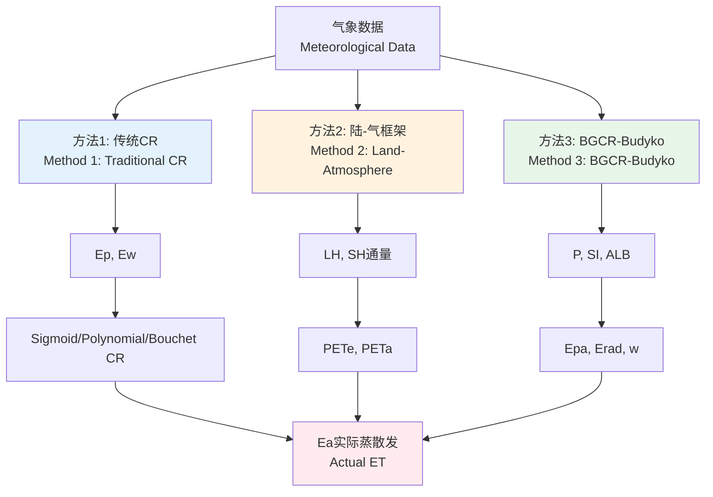

<!-- _class: lead -->

# PET-CR: 统一的蒸散发互补关系模型库

## Unified Complementary Relationship Evapotranspiration Library

**融合传统模型、陆-气框架与BGCR-Budyko方法**
**Integrating Traditional Models, Land-Atmosphere Framework, and BGCR-Budyko Method**

v0.3.0 | 2025

---

<!-- _class: lead -->

# 第一部分：简介
# Part 1: Introduction

什么是蒸散发与互补关系？
What are ET and Complementary Relationship?

---

## 什么是蒸散发 (ET) 与互补关系 (CR)？

### 基本概念 / Basic Concepts

**蒸散发 (Evapotranspiration, ET)**
- 水分从地表蒸发和植被蒸腾的总和
- 连接水循环和能量平衡的关键过程

**两个关键变量 / Two Key Variables**
- **Ea** (Actual ET / 实际蒸散发): 实际发生的蒸散发
- **Ep** (Potential ET / 潜在蒸散发): 水分充足时的最大蒸散发

---

## Bouchet互补假说 (1963)

```
┌──────────────────────────────────────────────────────┐
│  土壤变干 (Soil drying)                              │
│         ↓                                             │
│  Ea ↓  (实际蒸散发下降)                              │
│         ↓                                             │
│  更多能量加热空气 (More energy heats air)            │
│         ↓                                             │
│  大气干燥度↑ (Atmospheric aridity ↑)                 │
│         ↓                                             │
│  Ep ↑  (潜在蒸散发上升)                              │
└──────────────────────────────────────────────────────┘

核心思想: Ea + Ep = 常数 (在给定气象条件下)
Core idea: Ea + Ep = constant (under given meteorological conditions)
```

---

## 为什么需要互补关系？

### 传统问题 / Traditional Challenge

❌ **直接测量Ea困难**
- 涡度相关系统昂贵
- 空间覆盖有限
- 长期维护困难

✅ **CR的解决方案**
- 利用常规气象数据
- 通过Ep估算Ea
- 理论与观测相结合

---

<!-- _class: lead -->

# 第二部分：PET-CR库概览
# Part 2: PET-CR Library Overview

统一框架的"三驾马车"
Three Pillars of the Unified Framework

---

## PET-CR库的整体架构



---

## 三种方法对比表

| 特性 | 方法1 | 方法2 | 方法3 |
|-----|-------|-------|-------|
| **名称** | 传统CR模型 | 陆-气框架 | BGCR-Budyko |
| **核心输入** | Ep, Ew | LH, SH通量 | P, SI, ALB |
| **原始数据** | 气象站数据 | 涡度相关 | 气象+流域特征 |
| **时间尺度** | 日-月-年 | 半小时-日 | 月-年 |
| **空间尺度** | 站点-区域 | 站点 | 流域-区域 |
| **主要优势** | 数据易得 | 物理清晰 | 考虑异质性 |

---

<!-- _class: lead -->

# 第三部分：方法一
# Part 3: Method 1

传统CR模型 (Ep/Ew输入)
Traditional CR Models

---

## 方法一：理论基础

### 核心公式 / Core Formula
$$
Ea = f(Ep, Ew)
$$

### 计算流程 / Workflow

```
气象数据 (T, RH, U, Rn)
    ↓
[petcr.physics]
    ↓
Ep = penman_potential_et(...)
Ew = priestley_taylor_et(...)
    ↓
[petcr.models]
    ↓
Ea = sigmoid_cr(Ep, Ew, β)
```

---

## 方法一：五种经典模型

### 1. Sigmoid CR (Han & Tian, 2018)
```python
Ea = Ew + (Ep - Ew) / (1 + exp(-β(Ep/Ew - 1)))
```

### 2. Polynomial CR (Brutsaert, 2015)
```python
Ea = (b+1)*Ew - b*Ep    # b控制凹形程度
```

### 3. Rescaled Power CR (Szilagyi et al., 2017)
```python
Ea = Ew * (2 - (Ep/Ew)^n)    # n=0.5为最优
```

---

## 方法一：五种经典模型（续）

### 4. Bouchet CR (1963)
```python
Ea = 2*Ew - Ep    # 最简单的对称线性模型
```

### 5. Advection-Aridity CR (Brutsaert & Stricker, 1979)
```python
Ea = Ew + (Ew - Ea_min)*(1 - Ep/Ew)    # 非对称
```

**特点对比**
- Sigmoid/Polynomial: 适合湿润气候
- Bouchet: 最简单，快速估算
- A-A/Rescaled Power: 适合干旱气候

---

## 方法一：代码示例

```python
import petcr

# 1. 计算Ep和Ew
ep = petcr.penman_potential_et(
    net_radiation=500.0,        # W/m²
    ground_heat_flux=50.0,
    temperature=20.0,           # °C
    relative_humidity=50.0,     # %
    wind_speed=2.0,            # m/s
    pressure=101325.0          # Pa
)

ew = petcr.priestley_taylor_et(
    net_radiation=500.0,
    ground_heat_flux=50.0,
    temperature=20.0,
    pressure=101325.0,
    alpha=1.26
)

# 2. 应用CR模型
ea_sigmoid = petcr.sigmoid_cr(ep, ew, beta=0.5)
ea_bouchet = petcr.bouchet_cr(ep, ew)
```

---

## 方法一：典型结果可视化

**假设输入**: Ep变化，Ew固定

| 模型 | Ep=300 | Ep=400 | Ep=500 | Ep=600 |
|-----|--------|--------|--------|--------|
| **Ew (固定)** | 350 | 350 | 350 | 350 |
| Sigmoid (β=0.5) | 335.2 | 331.8 | 326.4 | 319.6 |
| Polynomial (b=2) | 350.0 | 300.0 | 250.0 | 200.0 |
| Bouchet | 400 | 300 | 200 | 100 |

📊 **观察**: Ep增加时，Ea一般减少（互补关系）

---

<!-- _class: lead -->

# 第四部分：方法二
# Part 4: Method 2

陆-气框架 (Zhou & Yu, 2025)
Land-Atmosphere Framework

---

## 方法二：理论基础

### 核心思想 / Core Concept

**两个互补的PET估算值**

1. **PETe** (Energy-based / 能量基础)
   - 最大ET受可用能量约束
   - `PETe = Rn / (1 + βw)`

2. **PETa** (Aerodynamics-based / 空气动力学基础)
   - 最大ET受大气需求约束
   - `PETa = SH / βw`

其中 `βw` 是湿润波文比 (wet Bowen ratio)

---

## 方法二：物理意义

### 理解 PETe vs. PETa

```
┌─────────────────────────────────────────────────────┐
│  (a) 干燥表面              (b) 假设湿润表面 (PETa)  │
│      Rn → SH↑                  Rn → LH↑             │
│      无蒸发                     大气需求最大         │
│                                                      │
│  (c) 实际湿润表面 (PETe)                            │
│      Rn → LH↑                                       │
│      能量约束                                        │
└─────────────────────────────────────────────────────┘

湿润指数 (Wetness Index): ET/PETa
干燥指数 (Dryness Index): PETa/PETe
```

**当 PETa > PETe**: 表面水分受限
**当 PETa < PETe**: 大气需求受限

---

## 方法二：观测到的互补关系

### 全球通量站数据验证

**发现的关系**:
- `ET/PETe` 与 `ET/PETa` 呈负相关
- `PETa/PETe` 随湿度指数线性下降

```
ET/PETe = 1.2 - 0.8 * (ET/PETa)

解释: 当实际蒸发接近PETa（湿润）时，
      它相对PETe的比例下降
```

这证明了**能量约束和动力约束之间的互补性**

---

## 方法二：代码示例

```python
import petcr

# 输入通量数据
results = petcr.calculate_pet_land(
    latent_heat=100.0,          # 潜热通量 [W/m²]
    sensible_heat=50.0,         # 感热通量 [W/m²]
    specific_humidity=0.01,     # 比湿 [kg/kg]
    air_pressure=101325.0,      # 气压 [Pa]
    air_temperature=298.15,     # 气温 [K]
    skin_temperature=300.15     # 表皮温度 [K]
)

# 输出结果
print(f"PETe: {results['pete']:.2f} mm/day")
print(f"PETa: {results['peta']:.2f} mm/day")
print(f"湿润波文比: {results['beta_w']:.3f}")
print(f"实际ET: {results['et']:.2f} mm/day")

# 典型输出:
# PETe: 5.91 mm/day  (能量约束)
# PETa: 6.30 mm/day  (大气需求)
# 湿润波文比: 0.344
# 实际ET: 4.35 mm/day
```

---

## 方法二：应用场景

### ✅ 最适合的场景

1. **通量塔站点分析**
   - 拥有涡度相关观测数据
   - 研究陆地-大气能量交换

2. **陆-气反馈诊断**
   - 识别能量限制 vs. 水分限制
   - 量化土壤湿度影响

3. **气候变化归因**
   - 分离气候效应和陆面效应
   - 1pctCO2实验分析

---

<!-- _class: lead -->

# 第五部分：方法三
# Part 5: Method 3

BGCR-Budyko模型
BGCR-Budyko Model

---

## 方法三：理论基础

### 核心公式体系

**1. 表观潜在蒸发** (Apparent Potential Evaporation)
```
Epa = Erad + Eaero
```
- `Erad = Δ/(Δ+γ) × (Rn-G)/Le`  (辐射项)
- `Eaero = γ/(Δ+γ) × f(U2) × (es-ea)`  (空气动力学项)

**2. Budyko曲线** (Tixeront-Fu形式)
```
E/Epa = 1 + P/Epa - [1 + (P/Epa)^w]^(1/w)
```

**3. 广义互补关系** (GCR)
```
通过三次方程求解 β_c
```

---

## 方法三：关键参数 - Budyko w

### 两种区域化方案

**BGCR-1** (单变量 / Single-variable)
```python
w = 0.214 - 0.651×SI + 7.350×SI²
```
- 仅使用降水季节性指数 (SI)

**BGCR-2** (双变量 / Dual-variable)  ⭐ 推荐
```python
w = 0.5931 + 7.0871×SI³ + 0.0175/ALB²
```
- 同时考虑季节性 (SI) 和反照率 (ALB)

**季节性指数 (SI)**:
```
SI = (1/Pa) × Σ|Pi - Pa/12|
```
SI越大，降水季节性越强

---

## 方法三：w参数的物理意义

### 流域特征的综合反映

**w值的变化范围**: 通常 1.0 ~ 3.0

| w值 | 流域特征 | 气候类型 |
|-----|----------|----------|
| **w < 1.5** | 强季节性降水<br/>高反照率（如青藏高原） | 高寒/干旱 |
| **w ≈ 2.0** | 中等季节性<br/>中等反照率 | 温带/半湿润 |
| **w > 2.5** | 弱季节性降水<br/>低反照率（如热带雨林） | 湿润/热带 |

**w的作用**: 调节Budyko曲线的弯曲程度

---

## 方法三：代码示例

```python
import petcr

# 输入: 气象数据 + 降水 + 流域特征
results = petcr.calculate_bgcr_et(
    net_radiation=150.0,              # 净辐射 [W/m²]
    temperature=20.0,                 # 气温 [°C]
    wind_speed=2.0,                   # 风速 [m/s]
    actual_vapor_pressure=1.5,        # 实际水汽压 [kPa]
    saturation_vapor_pressure=2.3,    # 饱和水汽压 [kPa]
    precipitation=80.0,               # 月降水 [mm]
    seasonality_index=0.5,            # SI [-]
    albedo=0.2,                       # 反照率 [-]
    use_dual_scheme=True              # 使用BGCR-2
)

print(f"月ET: {results['et']:.2f} mm")
print(f"表观Epa: {results['epa']:.2f} mm")
print(f"辐射项: {results['erad']:.2f} mm")
print(f"Budyko w: {results['w']:.3f}")
print(f"互补系数 β_c: {results['beta_c']:.3f}")
```

---

## 方法三：空间异质性处理

### 为什么BGCR适合异质流域？

**传统方法的局限**:
- Ep/Ew方法: 假设流域均一
- 通量方法: 仅站点尺度

**BGCR的优势**:
```
流域1: 高海拔, ALB=0.4, SI=0.8 → w=2.8
流域2: 低海拔, ALB=0.15, SI=0.3 → w=1.5
流域3: 中等, ALB=0.25, SI=0.5 → w=2.0
```

✅ 每个子流域有自己的w参数
✅ 反映地形、植被、气候差异
✅ 提高区域估算精度

---

## 方法三：典型应用案例

### 案例1: 青藏高原流域

**背景**:
- 强降水季节性 (SI = 0.9)
- 高反照率 (ALB = 0.45, 积雪)
- 稀疏植被

**BGCR-2计算**:
```
w = 0.5931 + 7.0871×(0.9)³ + 0.0175/(0.45)²
  = 0.5931 + 5.18 + 0.086
  = 5.86  (非常高，反映极端环境)
```

**结果**: E/Epa比值低，符合干旱高原特征

---

## 方法三：典型应用案例（续）

### 案例2: 长江中游流域

**背景**:
- 中等季节性 (SI = 0.5)
- 中等反照率 (ALB = 0.18, 农田/森林)
- 湿润气候

**BGCR-2计算**:
```
w = 0.5931 + 7.0871×(0.5)³ + 0.0175/(0.18)²
  = 0.5931 + 0.886 + 0.540
  = 2.02  (接近全球平均)
```

**结果**: E/Epa比值较高，符合湿润气候

---

<!-- _class: lead -->

# 第六部分：应用
# Part 6: Applications

ET变化归因分析
ET Change Attribution Analysis

---

## 应用：ET归因分析

### 核心问题

**ET的变化来自哪里？**

1. **气候变化** (Climate Change)
   - 温度升高 → PETe↑
   - 大气变干 → 大气需求↑
   - 降水变化 → P↑或↓

2. **陆面变化** (Land Surface Change)
   - 植被变化 (绿化/退化)
   - 土地利用变化
   - 灌溉增加/减少

**目标**: 量化分离这两种贡献

---

## 归因方法：基于Budyko框架

### 数学基础

利用Budyko方程的全微分:

```
ΔET = ∂ET/∂PETe × ΔPETe  +  ∂ET/∂P × ΔP  +  ∂ET/∂n × Δn
       ─────────────────────────────────    ─────────────
              气候贡献                        陆面贡献
           (Climate effect)                (Land surface effect)
```

**其中**:
- `PETe`, `P`: 气候变量
- `n`: Budyko参数（代表流域特征）
- `Δn`: 反映陆面变化

---

## 归因示例：全球陆地ET趋势

### 1881-2020年全球陆地ET变化

**观测趋势** (CMIP6 1pctCO2实验模拟):
- 总ET变化: +0.334 mm/day (140年)

**归因结果**:
```
ΔET_total    = 0.334 mm/day  ━━━━━━━━━━ (100%)
ΔET_climate  = 0.456 mm/day  ██████████░ (136%)
ΔET_landsurf = -0.122 mm/day ░░░░░░░░░░  (-36%)
```

**解释**:
- ✅ 气候变化促进ET增加（能量增加、湿度增加）
- ❌ 陆面变化抑制ET增加（可能是土壤退化、植被压力）

---

## 归因代码示例

```python
import petcr
import numpy as np

# 1. 生成140年时间序列（模拟1pctCO2实验）
data = petcr.generate_timeseries_data(
    n_years=140,
    include_trend=True,    # 包含CO2增加趋势
    seed=42
)

# 2. 执行归因分析
results = petcr.attribution_analysis(
    et_timeseries=data['et'],
    pete_timeseries=data['pete'],
    pr_timeseries=data['pr'],
    window_size=30    # 30年滑动窗口
)

# 3. 输出结果
print(f"校准Budyko参数 n: {results['n_parameter']:.3f}")
print(f"总ET变化: {results['et_total'][-1]:.3f} mm/day")
print(f"  - 气候贡献: {results['et_climate'][-1]:.3f}")
print(f"  - 陆面贡献: {results['et_landsurf'][-1]:.3f}")
```

---

## 归因结果可视化

### 时间序列分解图

```
ET变化 (mm/day)
  0.6 ┤
      │     ╱╲              ┌─ 气候贡献 (红色)
  0.4 ┤    ╱  ╲╲           │
      │   ╱    ╲╲          │
  0.2 ┤  ╱      ╲╲─────────┼─ 总ET变化 (黑色)
      │ ╱        ╲╲        │
  0.0 ┼╱──────────╲╲───────┼─ 基线
      │            ╲╲      │
 -0.2 ┤             ╲╲─────┴─ 陆面贡献 (蓝色)
      │              ╲╲
      └──────────────────────────
      1881  1920  1960  2000  2020
```

**关键信息**: 三条线相加关系
```
黑色 (总变化) = 红色 (气候) + 蓝色 (陆面)
```

---

<!-- _class: lead -->

# 第七部分：三种方法综合对比
# Part 7: Comprehensive Comparison

如何选择合适的方法？
How to Choose the Right Method?

---

## 三种方法对比：数据需求

| 数据类型 | 方法1 | 方法2 | 方法3 |
|---------|-------|-------|-------|
| **气温** | ✅ 必需 | ✅ 必需 | ✅ 必需 |
| **湿度** | ✅ 必需 | ✅ 必需 | ✅ 必需 |
| **风速** | ✅ 必需 | ❌ | ✅ 必需 |
| **辐射** | ✅ 必需 | ❌ | ✅ 必需 |
| **潜热通量 (LH)** | ❌ | ✅ 必需 | ❌ |
| **感热通量 (SH)** | ❌ | ✅ 必需 | ❌ |
| **降水 (P)** | ❌ | ❌ | ✅ 必需 |
| **流域特征 (SI, ALB)** | ❌ | ❌ | ✅ 必需 |

---

## 三种方法对比：计算复杂度

### 复杂度评分 (1-5, 5最复杂)

**方法1: 传统CR** ⭐⭐
- 两步计算: Ep/Ew → Ea
- 5种模型可选
- 参数需校准（如β, b, n）

**方法2: 陆-气框架** ⭐⭐⭐
- 多步计算: βw → PETe/PETa → Ea
- 涉及热力学公式
- 参数物理意义明确

**方法3: BGCR-Budyko** ⭐⭐⭐⭐⭐
- 复杂计算流程: Penman分量 → w参数 → 三次方程
- 需要额外流域信息
- 月尺度批量计算

---

## 三种方法对比：应用场景

### 🎯 推荐使用场景

**选择方法1** 当你有:
- ✅ 标准气象站数据
- ✅ 需要日尺度或更高时间分辨率
- ✅ 区域尺度快速估算
- ✅ 湿润-干旱转换研究

**选择方法2** 当你有:
- ✅ 涡度相关观测数据
- ✅ 研究陆地-大气能量交换
- ✅ 气候变化归因分析
- ✅ 诊断水分/能量限制

---

## 三种方法对比：应用场景（续）

**选择方法3** 当你有:
- ✅ 气象数据 + 降水数据
- ✅ 流域/网格尺度分析
- ✅ 月尺度长期趋势研究
- ✅ 空间异质性显著的区域
- ✅ 需要考虑降水季节性

**💡 最佳实践**:
结合多种方法进行交叉验证
```python
# 运行所有三种方法
python examples/compare_all_three_methods.py
```

---

## 实际案例对比

### 案例: 长江流域2020年7月ET估算

| 方法 | 输入 | 结果 | 优势 | 局限 |
|-----|------|------|------|------|
| **方法1** | 气象站<br/>Ep, Ew | 120 mm/月 | 数据易得<br/>计算快 | 忽略空间差异 |
| **方法2** | 通量塔<br/>LH, SH | 125 mm/月 | 物理清晰<br/>局地精确 | 站点代表性 |
| **方法3** | 气象+P+流域<br/>SI, ALB | 115 mm/月 | 考虑异质性<br/>适合流域 | 需流域数据 |

**真实ET** (卫星反演): 118 mm/月

✅ **结论**: 方法3最接近，因为考虑了空间异质性

---

<!-- _class: lead -->

# 第八部分：代码实战
# Part 8: Hands-on Coding

完整工作流程演示
Complete Workflow Demonstration

---

## 工作流程1: 单点站日尺度估算

```python
import petcr
import numpy as np
import pandas as pd

# 1. 准备10天气象数据
days = 10
data = pd.DataFrame({
    'Rn': np.random.uniform(400, 600, days),   # W/m²
    'G': np.full(days, 50.0),
    'T': np.random.uniform(18, 25, days),      # °C
    'RH': np.random.uniform(40, 70, days),     # %
    'U': np.random.uniform(1.5, 3.0, days),    # m/s
    'P': np.full(days, 101325.0)               # Pa
})

# 2. 方法1: 批量计算Ep和Ew
ep = petcr.penman_potential_et(
    data['Rn'], data['G'], data['T'],
    data['RH'], data['U'], data['P']
)
ew = petcr.priestley_taylor_et(
    data['Rn'], data['G'], data['T'], data['P']
)

# 3. 应用Sigmoid CR模型
ea = petcr.sigmoid_cr(ep, ew, beta=0.5)
data['ET_method1'] = ea
```

---

## 工作流程2: 通量站半小时数据

```python
# 1. 加载通量站数据 (半小时)
flux_data = petcr.load_fluxnet_data('site_data.csv')

# 2. 方法2: 批量计算PETe/PETa
results = petcr.batch_calculate_pet(
    latent_heat=flux_data['LE'],
    sensible_heat=flux_data['H'],
    specific_humidity=flux_data['Q'],
    air_pressure=flux_data['PA'],
    air_temperature=flux_data['TA'],
    skin_temperature=flux_data['TS']
)

# 3. 提取结果
flux_data['PETe'] = results['pete']
flux_data['PETa'] = results['peta']
flux_data['ET'] = results['et']

# 4. 日平均
daily_data = flux_data.resample('D').mean()
```

---

## 工作流程3: 流域月尺度空间分布

```python
import netCDF4 as nc

# 1. 加载网格数据 (lat, lon, time)
ds = nc.Dataset('basin_monthly_data.nc')
Rn = ds['net_radiation'][:]     # (12, nlat, nlon)
T = ds['temperature'][:]
U2 = ds['wind_speed'][:]
ea = ds['vapor_pressure_actual'][:]
es = ds['vapor_pressure_sat'][:]
P = ds['precipitation'][:]
ALB = ds['albedo'][:]           # (nlat, nlon)

# 2. 计算月SI (需要多年数据)
P_multiyear = ds['precipitation_allyears'][:]  # (nyear, 12, nlat, nlon)
SI = petcr.calculate_seasonality_index(P_multiyear)

# 3. 方法3: 空间批量计算
results = petcr.calculate_bgcr_et(
    net_radiation=Rn,
    temperature=T,
    wind_speed=U2,
    actual_vapor_pressure=ea,
    saturation_vapor_pressure=es,
    precipitation=P,
    seasonality_index=SI,  # (nlat, nlon)
    albedo=ALB
)

ET_monthly = results['et']  # (12, nlat, nlon)
```

---

## 可视化示例

```python
import matplotlib.pyplot as plt
import cartopy.crs as ccrs

# 创建地图
fig = plt.figure(figsize=(12, 8))
ax = plt.axes(projection=ccrs.PlateCarree())

# 绘制7月ET空间分布
im = ax.pcolormesh(
    lon, lat, ET_monthly[6, :, :],  # 7月 (索引6)
    cmap='YlGnBu',
    vmin=0, vmax=150,
    transform=ccrs.PlateCarree()
)

ax.coastlines()
ax.gridlines(draw_labels=True)
plt.colorbar(im, label='ET (mm/month)')
plt.title('2020年7月流域蒸散发 (方法3: BGCR-Budyko)')
plt.savefig('ET_spatial_july2020.png', dpi=300)
```

---

<!-- _class: lead -->

# 第九部分：总结与展望
# Part 9: Summary and Outlook

---

## 总结：何时使用哪种方法？

### 决策树 🌳

```
你有什么数据？
├─ 仅气象站数据 (T, RH, U, Rn)
│   └─ 使用【方法1: 传统CR】
│      • 快速、简单
│      • 多种模型可选
│
├─ 涡度相关通量数据 (LH, SH)
│   └─ 使用【方法2: 陆-气框架】
│      • 物理机制清晰
│      • 适合研究陆气反馈
│
└─ 气象数据 + 降水 + 流域特征 (P, SI, ALB)
    └─ 使用【方法3: BGCR-Budyko】
       • 考虑空间异质性
       • 适合流域尺度月估算
```

---

## PET-CR库的主要优势

### ✅ 为什么选择PET-CR?

1. **三种方法统一接口**
   - 一致的函数命名
   - 标准SI单位
   - 清晰的文档

2. **高质量实现**
   - 基于同行评审论文
   - 完整的参考文献
   - 经过验证的算法

3. **易用性**
   - 丰富的示例代码
   - 双语文档（中英文）
   - pip安装即用

---

## PET-CR库的主要优势（续）

4. **灵活性**
   ```python
   # 支持标量
   ea = petcr.sigmoid_cr(400.0, 350.0, beta=0.5)

   # 支持数组
   ea = petcr.sigmoid_cr(ep_array, ew_array, beta=0.5)

   # 支持多维网格
   ea = petcr.sigmoid_cr(ep_grid, ew_grid, beta=0.5)
   ```

5. **可扩展性**
   - 模块化设计
   - 易于添加新模型
   - 支持自定义参数

---

## 未来发展方向

### 🚀 v0.4.0及以后的计划

**新增功能**:
1. 不确定性量化 (Uncertainty Quantification)
2. 集成学习方法 (Ensemble Methods)
3. 实时数据接口 (Real-time Data APIs)
4. GPU加速 (GPU Acceleration for large grids)

**新增模型**:
1. 机器学习增强的CR模型
2. 耦合水文-生态模型
3. 极端事件专用模型

**数据支持**:
1. ERA5自动下载
2. MODIS ET产品对比
3. 全球站点数据库

---

## 学习资源

### 📚 推荐阅读

**基础理论**:
- Bouchet, R. J. (1963). Evapotranspiration réelle et potentielle.
- Brutsaert, W. (2015). A generalized complementary principle.

**陆-气框架**:
- Zhou, S., & Yu, B. (2025). Land-atmosphere interactions. Nature Climate Change.

**BGCR-Budyko**:
- Yang, D., et al. (2006). BGCR in non-humid environments. GRL.

**在线资源**:
- GitHub: github.com/your-org/PET-CR
- 文档: https://pet-cr.readthedocs.io/
- 示例: examples/ 目录

---

## 实践练习建议

### 💻 动手实践

**初级 (1-2小时)**:
1. 运行所有示例代码
2. 修改参数观察变化
3. 尝试自己的数据

**中级 (半天)**:
1. 比较三种方法的结果
2. 进行敏感性分析
3. 绘制空间分布图

**高级 (1-2天)**:
1. 实现自己的CR模型
2. 进行归因分析
3. 发表研究论文

---

## 获取帮助

### 🆘 支持渠道

**技术支持**:
- 📧 Email: shazhou21@bnu.edu.cn
- 🐛 GitHub Issues: 报告bug和功能请求
- 💬 讨论区: 分享经验和提问

**贡献代码**:
```bash
# Fork项目
git clone https://github.com/your-username/PET-CR.git

# 创建功能分支
git checkout -b feature/your-feature

# 提交PR
git push origin feature/your-feature
```

**引用库**:
使用本库发表论文时请引用相关文献

---

<!-- _class: lead -->

# 致谢与提问
# Acknowledgments & Questions

---

## 致谢 Acknowledgments

**核心贡献者 / Core Contributors**:
- PET-CR开发团队
- Zhou & Yu (陆-气框架)
- Yang et al. (BGCR-Budyko)

**数据来源 / Data Sources**:
- CMIP6气候模型数据
- FLUXNET全球通量观测网
- ERA5再分析数据

**资助 / Funding**:
- 国家自然科学基金
- 高等学校学科创新引智计划

**参考文献**: 详见README.md

---

<!-- _class: lead -->

# 谢谢！
# Thank You!

## Q & A
## 问答环节

**联系方式 / Contact**:
📧 Email: shazhou21@bnu.edu.cn
🌐 GitHub: github.com/your-org/PET-CR
📖 Docs: https://pet-cr.readthedocs.io/

**提示**: 运行示例代码开始你的PET-CR之旅！
```bash
python examples/compare_all_three_methods.py
```

---

<!-- _class: lead -->

# 附录
# Appendix

公式推导与技术细节
Formula Derivations and Technical Details

---

## 附录A: Penman方程推导

### 能量平衡方程

```
Rn = LE + H + G

其中:
- Rn: 净辐射 (Net radiation)
- LE: 潜热通量 (Latent heat flux) = λE
- H:  感热通量 (Sensible heat flux)
- G:  土壤热通量 (Ground heat flux)
```

### 空气动力学方程

```
LE = ρa λ (qs - qa) / ra
H  = ρa cp (Ts - Ta) / ra

其中:
- ra: 空气动力学阻抗
- qs, qa: 表面和空气比湿
- Ts, Ta: 表面和空气温度
```

---

## 附录B: Budyko框架数学

### 原始Budyko公式 (1974)

```
E/P = F(Φ, n)

其中 Φ = Ep/P (干燥指数)
```

### Tixeront-Fu形式 (推荐)

```
E/P = 1 + Φ - [1 + Φ^w]^(1/w)

当 w=1: 退化为简单形式
当 w→∞: E = min(P, Ep)
```

### 全微分形式 (用于归因)

```
dE = ∂E/∂Ep × dEp + ∂E/∂P × dP + ∂E/∂w × dw
```

---

## 附录C: BGCR三次方程推导

### 步骤1: GCR关系

```
E/Epo = f(Epa/Epo)
其中 Epo = βc × Erad
```

### 步骤2: Budyko关系

```
E/Epa = g(P/Epa, w)
```

### 步骤3: 消除 E/Epa

设 x = βc × Erad / Epa，联立上述两式，得到:

```
x³ - 2x² + z = 0

其中 z = 1 + P/Epa - [1 + (P/Epa)^w]^(1/w)
```

---

## 附录D: 单位换算表

| 变量 | 单位1 | 单位2 | 换算 |
|-----|-------|-------|------|
| **辐射** | W/m² | MJ/(m²·day) | 1 W/m² = 0.0864 MJ/(m²·day) |
| **ET** | W/m² | mm/day | 1 W/m² ≈ 0.035 mm/day (λ=2.45 MJ/kg) |
| **ET** | mm/day | mm/month | × 30 (近似) |
| **温度** | °C | K | K = °C + 273.15 |
| **气压** | hPa | Pa | 1 hPa = 100 Pa |
| **水汽压** | hPa | kPa | 1 hPa = 0.1 kPa |

**注意**: W/m²到mm/day的精确换算需要考虑λ的温度依赖性

---

## 附录E: 常见问题FAQ

### Q1: 三种方法的结果为什么不一致？

**A**: 正常现象！因为:
1. 输入数据不同（气象 vs 通量 vs 流域特征）
2. 时间尺度不同（日 vs 半小时 vs 月）
3. 空间代表性不同（点 vs 站 vs 流域）

**建议**: 根据研究目标选择合适的方法，而非追求结果一致。

---

## 附录E: 常见问题FAQ（续）

### Q2: 负的ET值怎么处理？

**A**:
- 物理上ET不能为负
- 可能原因: 极端气象条件、数据错误、模型参数不合理
- 处理方法: `EA = np.maximum(ea, 0.0)` (截断)

### Q3: 如何选择Sigmoid CR的β参数？

**A**:
- 默认: β = 0.5 (中等响应)
- 湿润气候: β = 0.3-0.4 (响应平缓)
- 干旱气候: β = 0.6-0.8 (响应陡峭)
- 最佳: 使用观测ET数据校准

---

## 附录F: 性能优化建议

### 大规模网格计算

```python
# 方法1: 分块计算 (推荐用于>10000网格)
def process_chunk(chunk):
    return petcr.calculate_bgcr_et(**chunk)

from multiprocessing import Pool
with Pool(processes=8) as pool:
    results = pool.map(process_chunk, data_chunks)

# 方法2: Dask并行
import dask.array as da
rn_dask = da.from_array(rn_array, chunks=(12, 100, 100))
results = petcr.calculate_bgcr_et(net_radiation=rn_dask, ...)

# 方法3: Numba加速（高级）
from numba import jit
@jit(nopython=True)
def fast_bgcr(...):
    # 自定义加速版本
```

---

<!-- _class: lead -->

# 演讲者备注完整版
# Full Speaker Notes

详见单独的演讲者备注文档
See separate speaker notes document

**文件**: `PET-CR_Teaching_Presentation_Notes.md`

---

<!-- _class: lead -->

# 结束
# End

**再次感谢！**
**Thank you again!**

🌍 让我们一起推动蒸散发研究的发展
🌍 Let's advance evapotranspiration research together

---
